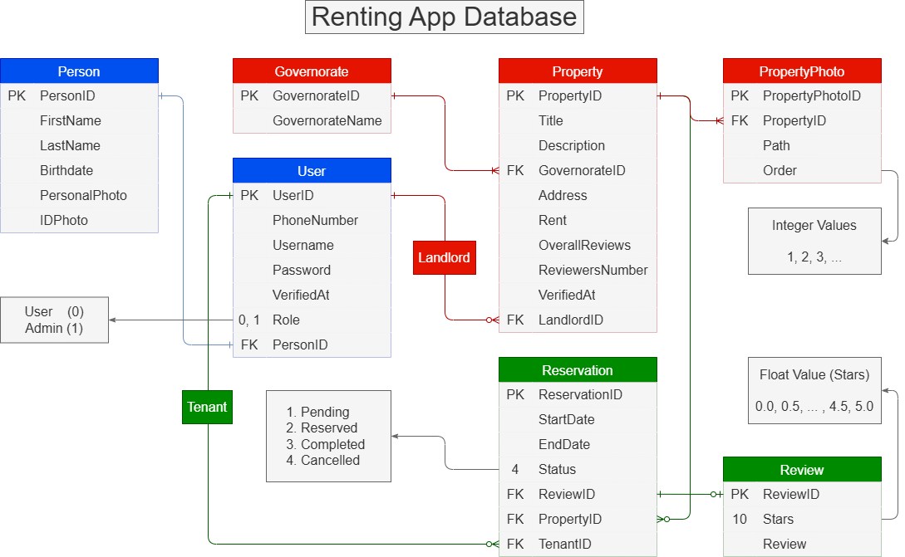

# Renting App

A simple Laravel backend API for managing basic rental app logic & data, with an admin dashboard website to handle verifing users and more.  

Built with **Laravel 12** and **Sanctum** for token-based authentication.

## API (User App) Endpoints

| Method | Path | Description |
|--------|------|-------------|
| POST   | `/api/auth/register`       | Register a new user |
| POST   | `/api/auth/login`          | Login and get API token |
| POST   | `/api/auth/logout`         | Logout and revoke tokens |
| GET    | `/api/user/show`           | Show user details |
| POST   | `/api/user/update`         | Update user profile |
| POST   | `/api/user/change-phone-number` | Change user phone number |
| POST   | `/api/user/change-password` | Change user password |
| DELETE | `/api/user/destroy`        | Delete user account |

## Web (Admin Dashboard) Endpoints

| Method | Path                   | Description                       |
| ------ | ---------------------- | --------------------------------- |
| GET    | `/login`               | Show admin login page             |
| POST   | `/login`               | Authenticate admin                |
| POST   | `/logout`              | Logout admin                      |
| GET    | `/`                    | Dashboard home (overview & stats) |
| GET    | `/users`               | List all users                    |
| GET    | `/users/{user}`        | Show single user details          |
| POST   | `/users/{user}/verify` | Verify a user account             |

# Database Diagram

